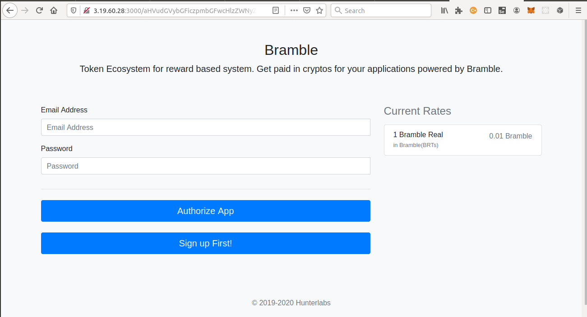

# Bramble API Flow

**1.** The user clicks the Bramble Authorize Button (Front Channel API Integration) 
He is directed to the URL by clicking on a Button

```

window.open('http://3.19.60.28:3000/'+btoa('client_id:client_secret_id'), '_self');

```
Then he is directed to this page.

 

User enters his credentials and he is redirected to your website

 

He is redirected on the Callback URL you provided. Suppose for example the callback url is 

```

http://flappybird.com/wallet_token

```
As you have received the **wallet token**(or the access token) at the callback url, save the wallet token(or access token) in your server for the particular user.

**2.** Authorization Code Request(Back Channel API Integration)

**Authorization Code Request 1**
----
  The Game Server receieves a Authorization code from this request.

* **URL**

  http://3.19.60.28:3000/authorise?response_type=code&client_id=CLIENT_ID&redirect_uri=CALLBACK_URL&state=TESTSTATE&scope=PROFILE

* **Method:**

  `POST`
  
*  **URL Params**

   **Required:**
 
   `response_type='code'
    client_id=[String]
    redirect_uri=[String]
    state=[String]
    scope=[String]
   `

* **Header Params**
  **Required:**
  `
  Authorization='Bearer ' + wallet_token
  `

* **Data Params**

  None

* **Success Response:**

  * **Code:** 200 <br />
    **Content:** `{
      "authorizationCode": "8b8c5ee88cf3f61043e7a5e372deae5374cfe91b",
      "expiresAt": "2020-03-23T14:14:52.796Z",
      "redirectUri": "CALLBACK_URL",
      "scope": "profile",
      "code": "8b8c5ee88cf3f61043e7a5e372deae5374cfe91b"
    }`
 
* **Error Response:**

 * **Code:** 400<br />
    **Content:** `{
    "code": 400,
     }`

  OR

  * **Code:** 401<br />
    **Content:** `{
      "code": 401,
    }`

  OR

  * **Code:** 500<br />
    **Content:** `{
      "code": 500,
    }`

  OR

   * **Code:** 500<br />
    **Content:** `{
      "code": 403,
    }`

* **Sample Call:**

  ```javascript
        var xhr = new XMLHttpRequest();
        authURL = "http://" + bramble.ip_address + "/authorise?response_type=code&client_id="+client_id+"&redirect_uri=CALLBACK_URL&state=teststate&scope=profile";
        xhr.open('POST',authURL, true);
        xhr.setRequestHeader("Authorization","Bearer "+ value);
        xhr.onreadystatechange = function() {

        if (xhr.readyState == XMLHttpRequest.DONE) {
                alert(xhr.responseText);
            }
        }
        xhr.send();
  ```

**3.** Authorization Request Part 2

**Authorization Code Request 2**
----
  Using the previous code, the final access Token which will help to send / receive data

* **URL**
    /oauth/token

* **Method:**

  `POST`
  
*  **URL Params**

   **Required:**
 
   None

* **Header Params**
  
  **Required:**
  `
  Authorization='Basic ' + base64('client_id:client_secret_id)')
  `

* **Data Params**
     `
      grant_type='authorization_code'
      code=CODE_RECEIVED_IN_THE_PREVIOUS REQUEST
      redirect_uri=CALLBACK_URL
     `

* **Success Response:**

  * **Code:** 200 <br />
    **Content:** `{
      "authorizationCode": "8b8c5ee88cf3f61043e7a5e372deae5374cfe91b",
      "expiresAt": "2020-03-23T14:14:52.796Z",
      "redirectUri": "CALLBACK_URL",
      "scope": "profile",
      "code": "8b8c5ee88cf3f61043e7a5e372deae5374cfe91b"
    }`

* **Sample Call:**

  ```javascript
        var xhr = new XMLHttpRequest();
        authURL = "http://3.19.60.28/oauth/token";
        xhr.open('POST',authURL, true);
        xhr.setRequestHeader("Authorization","Basic "+ btoa("client_id:client_secret_id"));
        let formData = new FormData();
        formData.append("grant_type", "authorization_code");
        formData.append(code, CODE_RECEIVED_IN_THE_PREVIOUS REQUEST );
        formData.append("redirect_uri", "http://localhost:3000/");
        xhr.onreadystatechange = function() {

        if (xhr.readyState == XMLHttpRequest.DONE) {
                alert(xhr.responseText);
            }
        }

        xhr.send(formData);
  ```

    authURL = "http://ip_address/redeem/"+$("#earned").html();
    xhr.open('POST',authURL, true);
    xhr.setRequestHeader("Authorization","Bearer "+ Cookies.get('access_token'));

**4.** Redeem Request
**Redeem Request Template**
----
 Final Request which will send data to Bramble server

* **URL**
    /redeem/:reward

* **Method:**

  `POST`
  
*  **URL Params**

   **Required:**
      `reward=[integer]` 

* **Header Params**
  
  **Required:**
      `
      Authorization='Bearer ' + token_received_in_the_last_step
      `

* **Data Params**

  None

* **Success Response:**

  * **Code:** 200 <br />
    **Content:** `URL which will direct to a Successfully Redeem Page`


* **Sample Call:**

  ```javascript
        var xhr = new XMLHttpRequest();
        authURL = "http://3.19.60.28:3000/redeem/"+$("#reward_earned").html();
        xhr.open('POST',authURL, true);
        xhr.setRequestHeader("Authorization","Bearer "+ token_received_in_the_last_step);        
        xhr.send();

        xhr.onreadystatechange = function() {
        
        if (xhr.readyState == XMLHttpRequest.DONE) {
            // alert(xhr.responseText);
            var win = window.open(xhr.responseText, '_blank');
            if (win) {
            //Browser has allowed it to be opened
            win.focus();
            } else {
                //Browser has blocked it
                alert('Please allow popups for this website');
                }
            }
        }
  ```

